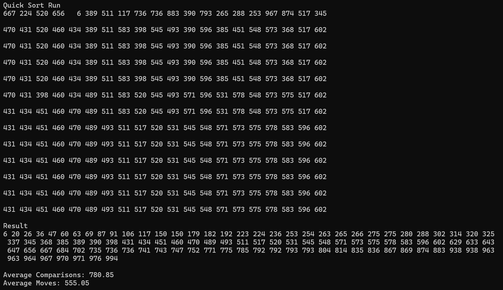

#quick sort {Result Image}

퀵정렬은 분할 정복법을 사용하며 평균적으로 가장 빠른 방법입니다.
선택정렬은 하나하나 전부 살펴보면서 가장 작은 값을 찾아 자리를 바꾸는 방식입니다.
선택정렬보다 퀵 정렬이 비교 횟수가 더 적으며 이동횟수는 선택정렬이 적지만 데이터 크기가 커지면 비교가 너무 많아져 전체적으로 비효율적입니다.

삽입정렬은 데이터를 순차적으로 정렬하며, 정렬 상태에 따라 성능이 크게 달라집니다.
비교 횟수의 경우 삽입 정렬은 데이터가 정렬되어 있을 때 빠르지만, 무작위 데이터에서는 퀵 정렬이 훨씬 빠릅니다.
이동 횟수의 경우 데이터 크기가 커질수록 퀵 정렬이 더 효율적입니다.

버블 정렬은 인접한 두 값을 비교하고 교환하는 방식입니다.
버블 정렬은 불필요한 비교가 많아 퀵 정렬과 비교 횟수가 퀵 정렬보다 훨씬 많으며 이동 또한 퀵 정렬보다 훨씬 많아 비효율적입니다.

쉘 정렬은 삽입 정렬의 개선된 형태로 특정 간격을 두고 정렬을 수행합니다.
쉘 정렬은 데이터 크기가 크면 퀵 정렬보다 비교와 이동이 많아질 가능성이 있습니다.

합병 정렬은 분할 정복 방식으로 데이터를 반씩 나눠 정렬한 후 합치는 방식입니다.
비교 횟수는 두 방식이 동일하며 합병 정렬은 병합과정에서 추가 메모리를 사용하여 데이터를 복사하므로, 퀵 정렬보다 메모리 효율성이 낮습니다.

결과적으로 퀵 정렬은 비교와 이동 모두 효율적이기 때문에, 데이터 크기가 크거나 복잡한 상황에서도 가장 적합한 정렬 방법이 될 수 있습니다.
