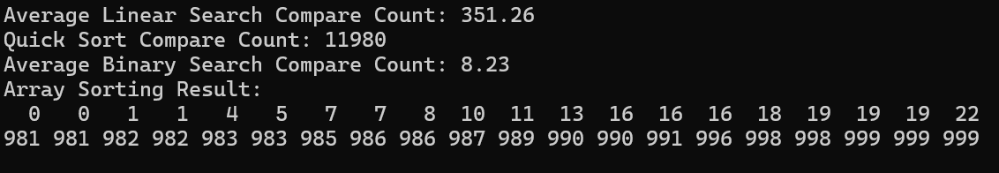

#Compare Search {Result Image}

퀵 정렬 후의 이진탐색이 순차탐색보다 적게 비교하는 이유의 첫번째는 탐색 범위가 축소되기 때문입니다. 이진 탐색은 한 번의 비교로 탐색 범위를 절반으로 축소됩니다. 순차 탐색의 경우 타겟 값이 배열의 뒤쪽에 존재하는 경우 최대 배열의 크기 만큼 비교를 하여야 합니다. 하지만 이진 탐색의 경우 log N번의 비교로 끝낼 수 있습니다. 
 두번째 이유는 탐색 중복 방지가 되기 때문입니다. 순차 탐색은 모든 요소를 순서대로 확인하기 때문에 타겟 값을 찾기 전까지는 불필요한 비교가 발생합니다. 하지만 이진 탐색의 경우 정렬된 상태에서 탐색 범위를 효율적으로 줄이기 때문에 중복된 비교가 발생하지 않습니다. 
