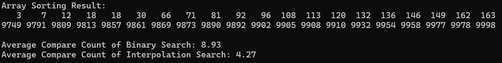
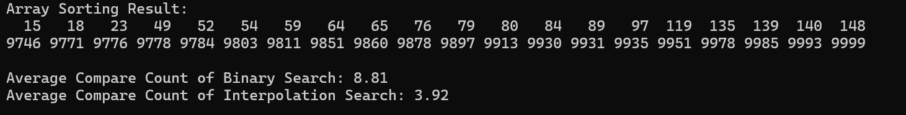
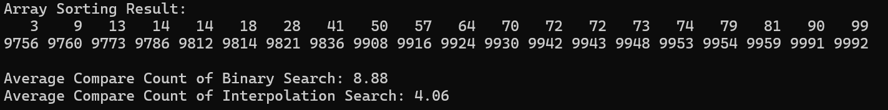

#Interpolation Search {Result Image}

Interpolation Search가 Binary Search보다 적게 비교하는 이유는 이진 탐색의 경우 항상 가운데 값을 확인하므로 값이 한쪽 끝에 있을 때도 불필요한 비교를 하게 됩니다. 하지만 보간 탐색은 값이 어디쯤에 있을 지를 미리 계산하여 탐색을 시작하므로 비교 횟수를 줄일 수 있습니다. 특히 데이터가 고르게 분포 되어 있을 경우 보간 탐색은 더욱 효율적입니다. 
