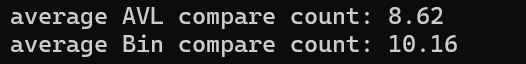
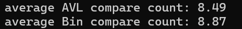
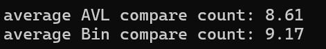

#Compare AVL {Result Image}

AVL 트리는 삽입, 삭제, 탐색 연산 동안 트리의 균형을 유지합니다. 균형 유지 과정에서 회전 작업이 수행되지만, 검색 깊이가 더 낮기 때문에 비교 횟수가 줄어듭니다. 반면 이진 탐색 트리는 균형이 보장 되지 않기 때문에 삽입/삭제가 비효율적으로 이루어질 가능성이 있습니다. 트리가 한쪽으로 치우친 경우 비교 횟수가 크게 증가할 수 있습니다. 결과를 보면 AVL 트리의 평균 비교 횟수가 항상 이진 탐색 트리보다 낮게 나타납니다. 이는 AVL 트리가 균형 잡힌 상태를 유지하여 탐색 시 비교 횟수가 줄어들기 때문입니다. 
